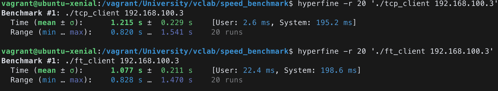
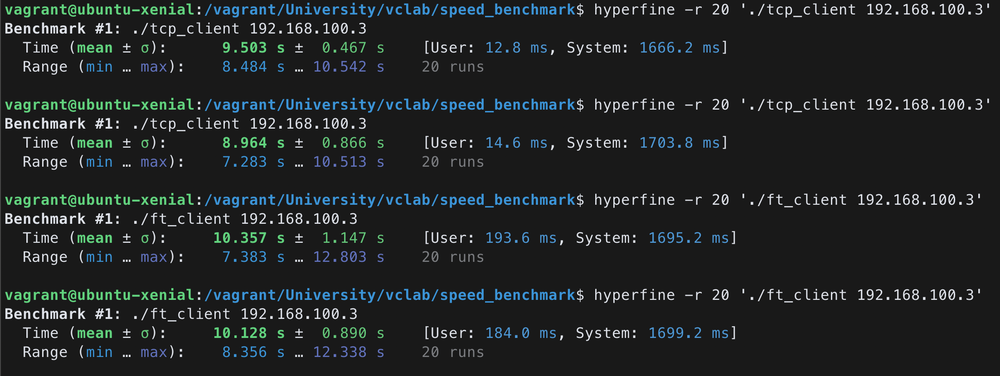

# Experiment

This repository serves a purpose to measure the speed between gRPC and TCP socket file upload. 

## Installation

[Here is a good guide](https://github.com/IvanSafonov/grpc-cmake-example) on how to setup a gRPC libraries and dependencies. 

For benchmarking I have used [Hyperfine](https://github.com/sharkdp/hyperfine), but any measurement tool is fine.

## Methodology

1. In `generate.sh` write the desired size of the file for benchmarking. For example, this script writes 10MB to `file.txt`. 

```sh
dd if=/dev/urandom of=file.txt bs=1M count=10
```

2. Build with CMake. It will generate executables: `ft_server`, `ft_client`, `tcp_server`, `tcp_client`.

```sh
mkdir build
cd build
cmake ..
make
```

3. Generate the file with desired size:

```sh
# in 'build' folder
sh generate.sh
```

4. From one computer run server (`ft_server` or `tcp_server`):

```sh
./ft_server
```

5. From another computer (or the same one), run client with IP address of server as a parameter (`ft_client` or `tcp_client` respectively)

```sh
./ft_client 192.168.1.2
```

6. (Benchmarking) Running benchmarking (from client computer) with hyperfine is fairly easy:
 
```sh
hyperfine './ft_client 192.168.1.2'
```

## Preliminary results

1MB file transfer (20 runs). 



10MB file transfer (20 runs x 2).



> The measurements were made in home wireless network. 

## NOTES

- Most of the values are hardcoded
- For now it is ambiguous whether both implementations are fairly compared. 
- Perf report would shed the light on the network related functions' performance. 
- The results might change due to environment or circumstances.
